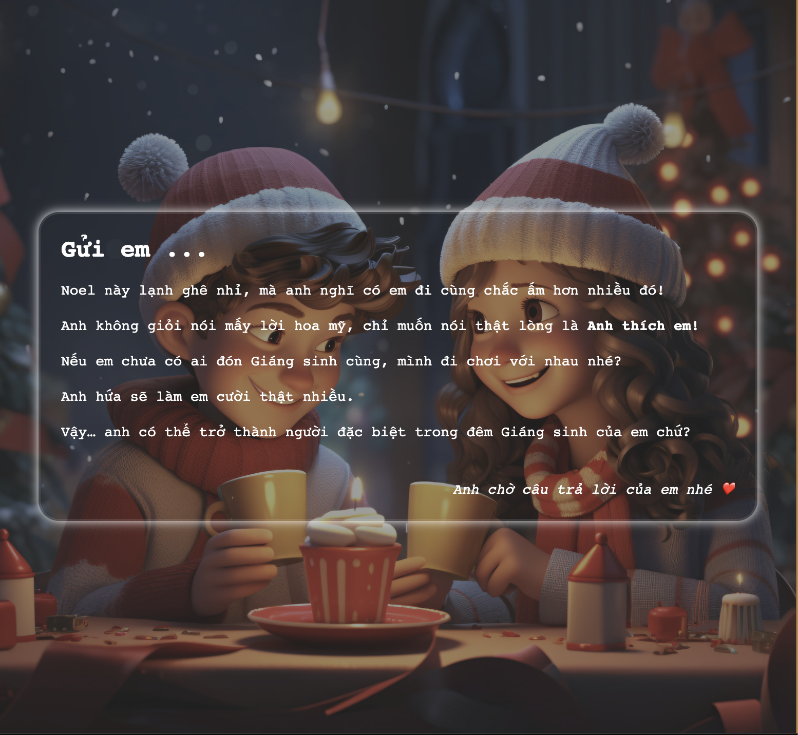

# 💌 **Christmas Confessing Love Letter** 🎄

This project displays a romantic and festive Christmas-themed love letter using **HTML**, **CSS**, and **JavaScript**. Perfect for surprising someone special this holiday season! ❤️

## 📸 **Preview**

Here's an example of the final result:

<div style="display: flex; justify-content: center;">
   
   
</div>


## ✨ **Features**
- 💖 Beautiful and responsive layout for all devices.  
- 🎨 Smooth animations for a cozy and romantic feel.  
- 🖼 Festive visuals (envelope, heart, Christmas background).  
- 💻 Clean and customizable HTML, CSS, and JS structure.  

---

## 🛠 **Technologies Used**
- **HTML5**: Structure of the love letter.  
- **CSS3**: Styling, layout, and animations.  
- **JavaScript**: Optional interactivity like animations or hover effects.  

---

## 🚀 **How to Set Up**

1. **Clone the repository**:
   ```bash
   git clone https://github.com/duynguyen-workspace/love-letter.git
   cd love-letter
   ```
2. Open index.html
3. Enjoy the animated and festive love letter! 💖

---

## 💡 **Customization**

You can personalize the letter's content in the **letter.html** file:
  ```bash
  <p><strong>Gửi em...</strong></p>
  <p>Noel này lạnh ghê nhỉ, mà anh nghĩ có em đi cùng chắc ấm hơn nhiều đó!</p>
  <p>Anh không giỏi nói mấy lời hoa mỹ, chỉ muốn nói thật lòng là <b>Anh thích em!</b></p>
  ```
---

## 🎅 **License**

This project is open-source. Feel free to use and customize it to spread love this Christmas! 🎄
